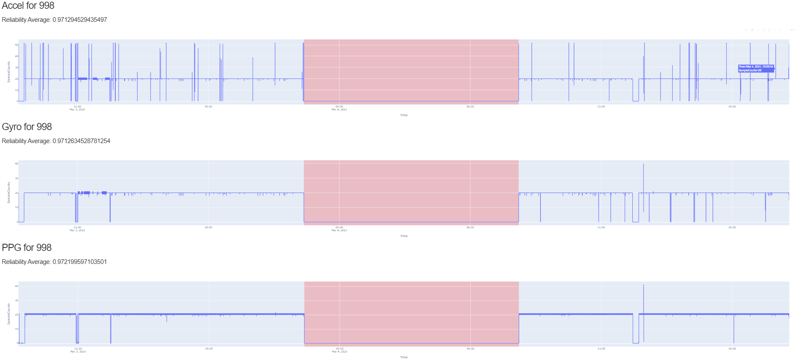
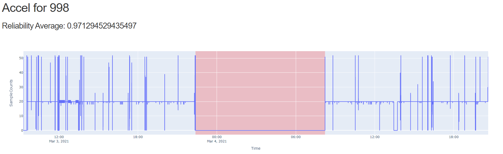

## Wrist Signal Reliability Check

Project to quickly check the reliability of the signal from wrist worn sensor. 
The project will:
1. Download data directly from cloud storage
2. Clean, sort, and aggregate data
3. Calculate reliability average for only wear times
4. Plot reliability signal for each sensor A

### Azure.conf
In order for this project to work to directly pull data down from Azure storage the user must create a file in the root directory of project named `azure.conf`
The file contents should be:
```
[azure]
connectionstring = "DefaultEndpointsProtocol=https;AccountName=[ACCOUNT_NAME];AccountKey=[ACCOUNT_KEY];EndpointSuffix=
```
> replace the [ACCOUNT_NAME] and [ACCOUNT_KEY] with the user specific connection string details from Azure account
> The repo has the code to download from Azure storgae commented out to use this functionality uncomment the code in main.py
``` 
#download_path = os.path.join(args.input)
#download_data.download_data(args.participant, download_path)
```

### Usage 
- clone repo `git clone [repo url](repo url)`
- cd into repo `cd [repo name]`
- Install dependencies `pip install -r requirement.txt`

- The repo include sample data. 


### Running program
> Used for sensewhy study where participant wrist data is stored in Azure blob with container names as their 3 digit participant id
- `python main.py Data 999`
> This command will run on the sample data included in the repo

- There are two addition option arguments [port] and [sample rate]
- If you would like to run mutliple plots are the same time you can specify port. If port is left out, default will be 8050
-  Default sample rate is 20, if you need to specify you can
>  `python main.py Data 999 8051 40`

### Viewing Data
- Once the program runs and complete processing the plot will be posted at localhost:8050 (unless port was specified)
- The plot reports the average reliability for wear time data (non-wear time is highlighted with red) 
- Non-wear time is specified if the signal is 0 for more than 30 minutes





